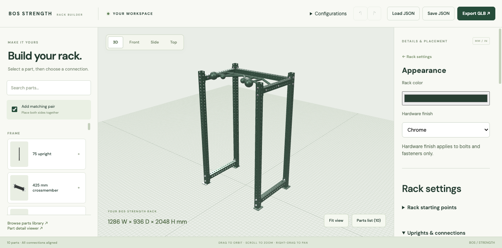
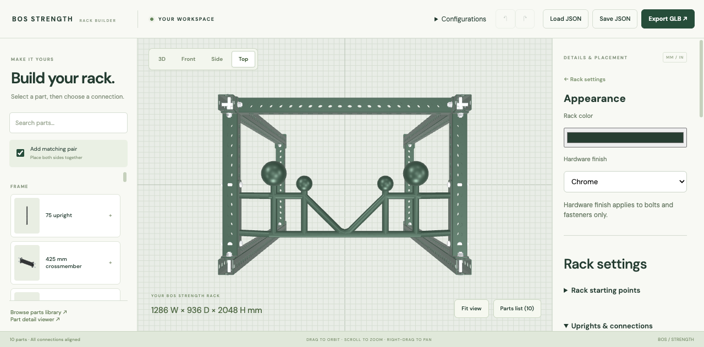
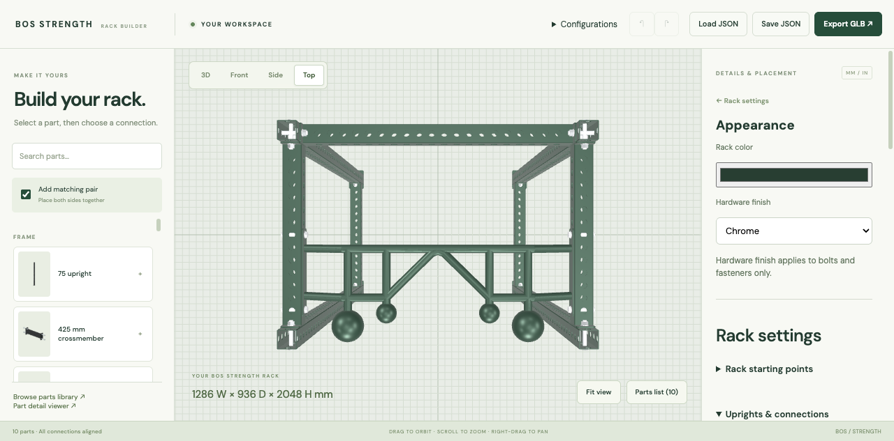

# Spherical pull-up mount orientation (#24)

Captured in the actual builder at `http://127.0.0.1:5301/builder` using the
isolated browser session `gym-wave2-orientation`. Both captures use the same
1075 × 725 × 2032 mm generic rack with one front spherical bar and no other
accessories. Top view: front opening is at the bottom, rear crossmember at top.

| View | Before | After |
| --- | --- | --- |
| 3D |  |  |
| Top |  |  |

The spheres formerly projected rearward into the rack. They now project toward
the front user opening while remaining reachable inside the clear rack span.
The mounting plates occupy the same rail stations.

## Source and transform evidence

Inspected `rack-generator/reference/decoded/pullup-sphere.json`, generated from
`front.glb` node `Spherical multi-grip pull up bar 2100.013`, and the decode axis
conversion (`x = source x`, `y = -source z`, `z = source y`, millimetres).
The decoded solid spans X ±537.5, Y ±221.19426, Z 0–162.13910 mm. The reconstruction
retains the decoded asymmetric plate center Y = -46.194 mm, bolt stations
Y = -196.194 / 103.806 mm, and sphere centers Y = 158.806 / 108.806 mm.
These coordinates describe the source part correctly; geometry was not changed.

For the default front mount the plate center stays at world Y = -150 mm.
The instance origin changes from -103.806 to -196.194 mm and rotation from 0 to π.
Bolt stations remain world Y = -300 / 0 mm at both X = ±537.5 mm and Z = 1915 mm.
The X anchor signs reverse so each mount still names the correct physical rail.
Rear sphere placement already faces outward and remains unchanged, as do both
other pull-up variants. Collision envelopes use the same instance transform.

Regression tests cover front/rear placement at 425/725/1075 mm depths, outward
sphere centers, all four transformed anchors, actual rail pitch/height, an
obstruction at a sphere, and unchanged straight/multi-grip transforms. The front
assembly has no collision warnings. The pre-existing rear-sphere/rear-crossmember
collision remains reported; removing that beam clears it. No certified physical
fit claim is made.
